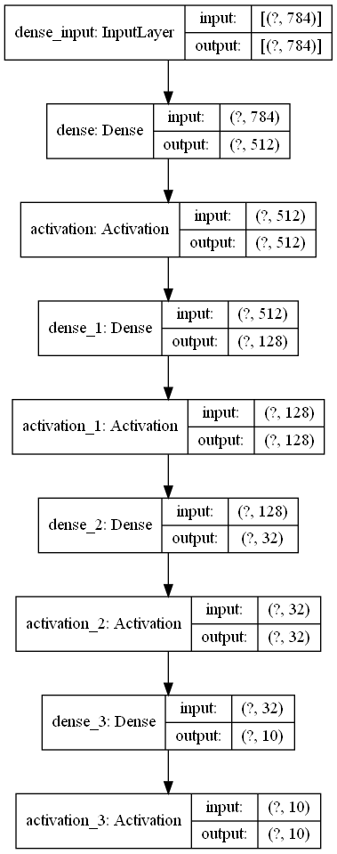
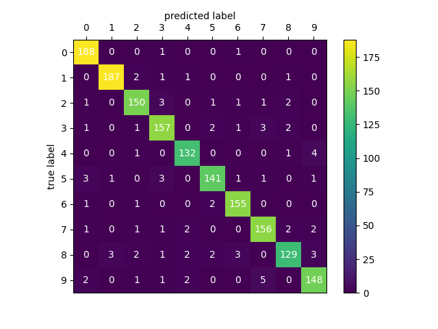
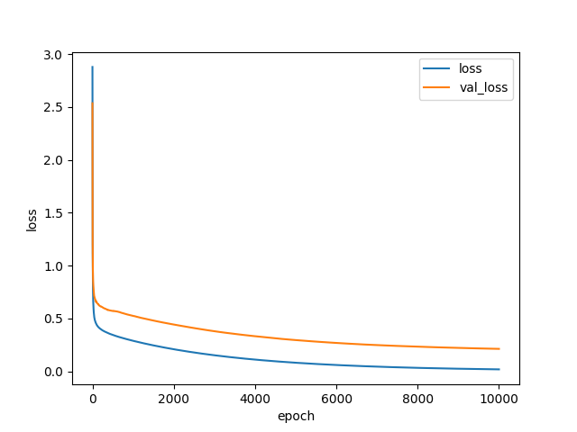
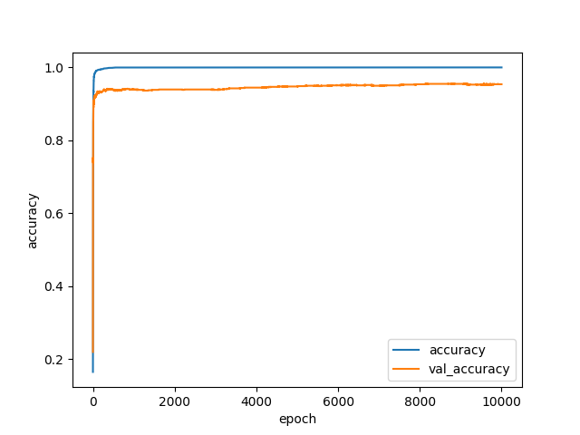
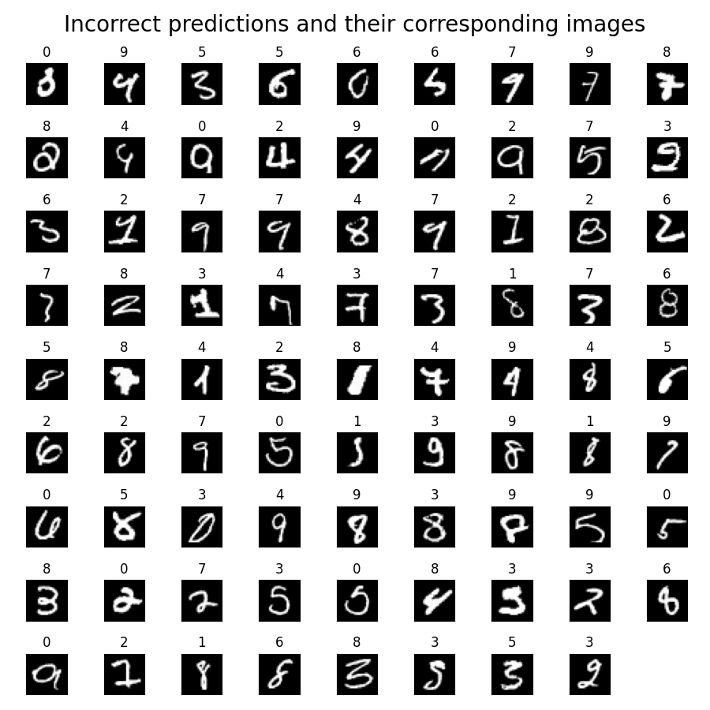

# Project 3: Artificial Neural Networks, Digit Recognition

Rafael Pimentel, N'yoma Diamond

## Model & Training Procedure Description

One of our first experiments was to stay with only one hidden layer and just mess with the number of nodes in it. We noticed that having a lot of nodes (at least one for every pixel) in this single layer was very effective during training, but resulted in significant overfitting and was much slower to train. However, this immediately gave us an okay model to test other hyperparameters with. From there we tested various kernel initializers and activation methods to see what worked best with the single hidden layer. Aditionally, we tested using Dropout layers, which allowed us to avoid overfitting by dropping some of the connections in between perceptrons, this allowed us to get accuracies of around 95% to 97%, unfortunately we asked during office hours if this was allowed during experimentation, and were told that only dense layers with different activation functions were allowed.

This knowledge in hand, we scaled back the number of nodes in the first hidden layer and started adding more hidden layers. We made some educated guesses on what we believed would result in less overfitting and a better model. Once we found a model we liked, we started experimenting with epoch count and batch size to see if we could pull any more minor improvements out of our model. We quickly noticed that after a certain amount of epochs the accuracy would stop improving. To deal with this, we set up callbacks so that we could train for a large number of epochs and let training automatically halt when performance stopped seeing meaningful/consistent improvement. We also simultaneously tested what would happen if we let the AI train for a very large number of epochs (50,000-100,000 epochs) and then analyze the performance over time to find where peak performance was reached. This was how we settled on the number of epochs we did. Throughout this process we made occasional semi-random changes to certain hyperparameters (such as activation functions) just to confirm that what we had was optimal (if changing something resulted in improved performance, we would pursue that change and see if other things could be altered similarly). By using this method we also noticed that using the tanh activation function in our last layer, after a certain amount of layers with a relu activation function, gave us an accuracy boost of around 2%.

## Model Performance & Confusion Matrix

The most effective model we reached had three hidden layers: in order, the layers had 512, 128, and 32 nodes respectively. All but the last hidden layer used the relu activation function, while the last one used tanh. All layers were initialized using the random_uniform intialization scheme. In our training we used a batch size of 512 and trained for 10,000 epochs (to be honest we probably could have stopped much earlier but 10,000 is a nice number and the model still saw consistent, albeit very minor, improvements up to 10,000 epochs).

## Training Performance Plot

Loss               |  Accuracy
:-----------------:|:--------------------------:
  |  

## Visualization

We aren't exactly clear as to why our AI missclassifies many of the images it does. The images that are missclassified are always different as a result of us using the Law of Large Numbers to let us randomize our training/validation/testing sets to stratify our data. Because of this there isn't really any clear way for us to identify if our algorithm is consistently wrong on certain things for specific reasons. That said, it appears pretty consistent in its mistakes, so it isn't consistently mistaking some numbers for others. That said, there are a few images in the data set that aren't exactly clear in their own right: there is a 2 that looks like an 8; a 5 that looks like a 2; a few 9's and 6's look like 0's; a couple 7's look like 1's and vice-versa; and a couple that are arguably illegible.

