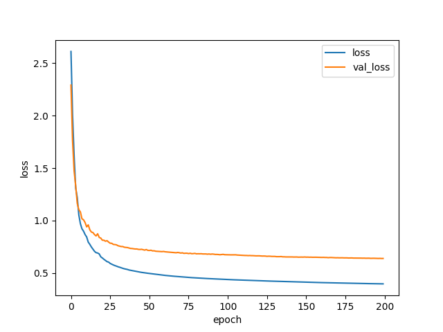
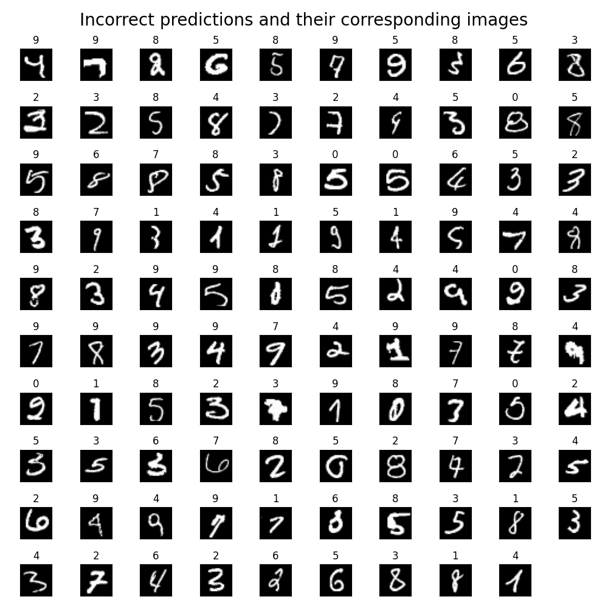

# Project 3: Artificial Neural Networks, Digit Recognition

Rafael Pimentel, N'yoma Diamond

## Model & Training Procedure Description

For our first experiments, we decided to start adding hidden layers, and changed the amount of epochs that we had.
After a certain amount of epochs the accuracy would stop improving.

## Model Performance & Confusion Matrix

The most effective model we reached had three hidden layers: in order, the layers had 512, 128, and 32 nodes respectively. All but the last hidden layer used the relu activation function, while the last one used tanh. All layers were initialized using the random_uniform intialization scheme. In our training we used a batch size of 512 and trained for 2000 epochs.

## Training Performance Plot

Loss               |  Accuracy
:-----------------:|:--------------------------:
  |  

## Visualization

